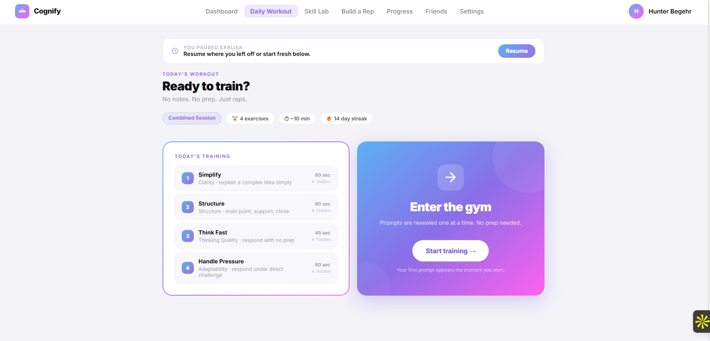
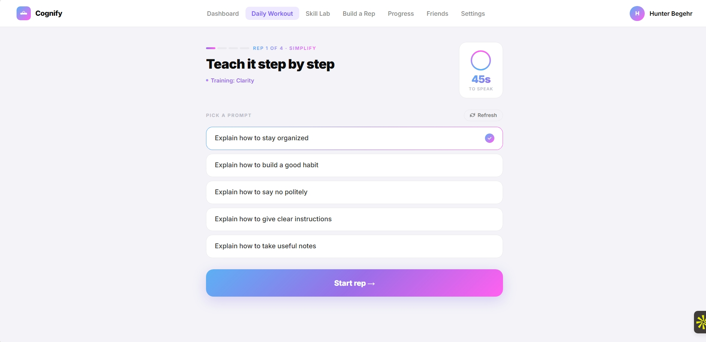
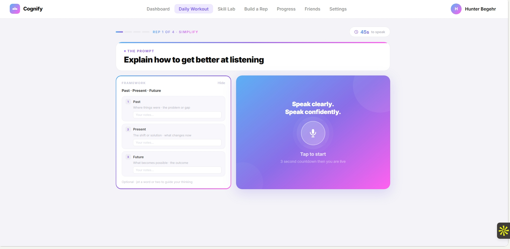
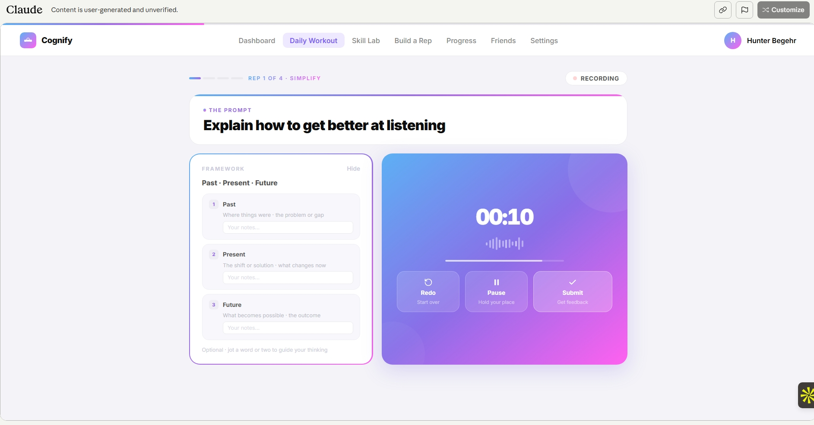

# V2 Final Push — Everything Left

> **Status:** Drafted 2026-04-24. The master plan for closing out everything in V2 Updates.docx, Cognify Direction.md, and Cognify Strategic Update.md. Both UI polish AND backend infrastructure.
>
> **Why this exists:** `V2_STRATEGIC_PLAN.md` is the high-level strategy. This doc is the tactical "finish the V2 promises" roadmap — every open item from the three source docs, organized by phase, with schema/API/UI notes for each.
>
> **Branch:** `feat/gym-core` for all of it unless a specific phase needs its own branch. Merge back to `supabase-migration` when complete.

---

## The four target mockups (V2 Updates.docx)

These are the reference designs we're building toward. Every Phase 3 decision traces back to one of these.

### Mockup #1 — Daily Workout Home

Key elements: chip row (Combined Session · 4 exercises · ~10 min · streak) · left "Today's training" numbered list with **hidden lock icon per rep** · right gradient "Enter the gym" card with single Start CTA · paused-earlier resume banner above.

### Mockup #2 — Exercise / Prompt Pick

Key elements: REP N of M dash progress row · consumer-friendly rep display title as H1 ("Teach it step by step" — not "Simplify") · "Training: Clarity" dimension label with dot · **circle timer badge** ("45s TO SPEAK") top-right · 5 prompt cards with selection affordance · Refresh button · full-width gradient Start rep CTA.

### Mockup #3 — Start / pre-rep

Key elements: two-column layout · left = FRAMEWORK card with **per-node notes inputs** + "Optional · jot a word or two to guide your thinking" · right = gradient "Speak clearly. Speak confidently." hero with mic icon + "Tap to start" + "3 second countdown then you are live" · Hide framework toggle.

### Mockup #4 — Actual Rep / recording

Key elements: RECORDING pill indicator top-right · prompt card with thin progress bar on top · left column preserves framework with notes · right column = MM:SS countdown (centered large) · waveform visualization · **3 action tiles (Redo / Pause / Submit)** at bottom of gradient card.

---

## Phase 0 — Pre-flight decisions (need your sign-off before execution)

### D1 — WS-1 dimension rename
Docs + mockups use `Clarity · Structure · Conciseness · Thinking Quality · Delivery · Adaptability`. Code uses `Clarity · Structure · Relevance · Confidence · Pacing · Tone`. Decision doc at `docs/DIMENSION_DECISION.md` needs your approval. **Blocks clean UI labels everywhere. Recommend approve + run in Phase 1.**

### D2 — DB migrations
Everything in Phase 1 below adds columns and tables to Supabase. Migrations run against the Supabase `cognify_v2` schema. **Need confirmation you're comfortable running them** (I can write + review them; user runs `npx drizzle-kit push` or I run it if you grant access).

### D3 — Mockup fidelity level
Mockups show specific two-column layouts, gradient side cards, rep display titles. Two options:
- **"Pixel match"** — match the mockups as closely as possible, including the two-column record layout, exact chip styling, etc. More UI work.
- **"Spirit match"** — adopt the key new mechanics (rep display titles, hidden prompts, circle timer, 3-tile action row, "Enter the gym" gradient card) but keep the current single-column layout where it reads better on mobile.

**Recommend spirit match** — full two-column recording screen is awkward on phones, and the user has repeatedly said "close to concept, not exact". Flagging so you can overrule.

---

## Phase 1 — Backend foundation (schema + persistence)

Everything we've built that currently lives in localStorage or topic-string-hacks gets proper DB backing. Unblocks cross-device consistency and real analytics.

### 1.1 — Schema migrations
- **`workout_sessions.sessionType`** enum (`'focus' | 'combined' | 'flow'`) — persists session type for per-type streak and analytics splits
- **`workout_sessions.focusDimension`** enum nullable — for Focus sessions only
- **`reps.pressureArchetypeId`** enum nullable (`'pushback' | 'time_compression' | 'audience_switch' | 'clarifying_interrupt' | 'stakes_raise'`) — replaces the `topic LIKE 'Pressure · %'` hack
- **`users.streakFreezes`** int default 0 — habit system streak protection
- **`users.lastPressureArchetypeId`** enum nullable — feeds `previousPressureArchetypeId` so next-session excludes the prior archetype (cross-session, not just cross-rep)
- **`users.lastSessionWeakestDimension`** enum nullable — caches tomorrow's-focus bias server-side
- **`weekly_reports`** table — `id · userId · weekStartISO · narrative (json) · generatedAt` — persists Claude-generated weekly recaps
- **`personal_bests`** table — `userId · dimension · score · achievedAt · repId` — supports cross-device PB detection
- **`install_prompt_state`** (optional) — could live on `users` table as `installPromptDismissedAt`, `completedRepCountHint`
- **WS-1 rename** — if approved in D1, swap dimension enum values + add `dimension_aliases` table for historical-score reads

### 1.2 — Query + API layer
- Refactor `getPressureRepStats` to use `reps.pressureArchetypeId` (not topic LIKE)
- New `saveSessionType(sessionId, type, focusDim)` action
- New `saveWeeklyReport(userId, weekStart, narrative)` — cron writes, read returns cached
- New `getStreakFreezesRemaining(userId)` + `applyStreakFreeze(userId)` + `awardStreakFreeze(userId)` actions
- `POST /api/streak-freeze/apply` route (the client rarely calls directly; server auto-applies during streak computation)
- New `savePersonalBest(userId, dimension, score, repId)` — triggered from the score-internal or save-rep path
- `/api/weekly-narrative` switches from on-demand to DB-backed with 24h refresh window
- Background: nightly streak recompute that auto-applies freezes when a gap is detected

### 1.3 — Install prompt & rep count
Move `cognify_completed_reps_v1` localStorage → server-backed count via `users.completedRepsCount` integer. Install prompt gate reads from server on mount.

---

## Phase 2 — WS-1 Dimension Rename (if approved in D1)

Execution plan already at `docs/proposals/rubric-v2.0.0.md`. One-day apply when D1 signs off.

- Update `src/types/domain.ts` with new names
- `RUBRIC_VERSION` → `v2.0.0`
- Codemod `pressure-archetypes.ts` weight profiles to new keys
- UI label sweep (SixSkillsBar, FeedbackPanel, SkillRadar, Progress page, marketing pages, knowledge base MDs)
- One-time in-app note on first post-rename login
- Historical reps keep their original rubric version tag (no re-scoring)

---

## Phase 3 — Mockup UI redesigns

### 3.1 — Rep display titles + archetype display titles
Add `displayTitle: string` to every rep type in `rep-types.ts` (9 titles). Draft:
- `simplify` → "Teach it step by step"
- `structure` → "Main point, support, close"
- `think_fast` → "Respond with no prep"
- `be_concise` → "Say the most in the fewest words"
- `reinforce` → "Walk through it like you're teaching"
- `persuade` → "Convince them to act"
- `adapt` → "Same idea, two audiences"
- `deliver` → "Pace + pauses that hold attention"
- `handle_pressure` → "Hold your ground when challenged"

Titles surface in `WorkoutPromptSelect` H1, the Daily Workout Home "Today's training" list, and the rep phase header.

### 3.2 — CircleTimer component (mockup #2)
Animated ring countdown showing "45s TO SPEAK" in the corner of the exercise page. Replaces current flat "Budget: 60s" pill. Client-side component with SVG stroke-dashoffset animation; respects reduced-motion.

### 3.3 — ProgressDots component polish
Make the "REP 1 OF 4" dashed-indicator match mockup exactly — 4 thin-dash segments, the current one filled gradient, later ones muted ink-200.

### 3.4 — Daily Workout Home two-column layout (mockup #1)
Rebuild `WorkoutIntro` layout:
- Header chip row: session-type chip + `X exercises` chip + `~N min` chip + streak chip
- Left card: "Today's training" numbered list with rep `displayTitle` + dimension label + duration + **hidden lock icon**
- Right card: gradient "Enter the gym" hero with arrow icon + "Prompts are revealed one at a time." copy + big "Start training →" CTA + "Your first prompt appears the moment you start." footer

### 3.5 — Hidden prompt reveal
When the user starts a workout, the first rep reveals its prompt immediately. Subsequent reps show "hidden" until the user completes the prior rep. Schema-wise: client-side gate in WorkoutSession (plan.reps[i].prompts hidden in UI until currentIndex reaches i).

### 3.6 — Start page two-column (mockup #3)
Rebuild pre-rep state of `RepSurface`:
- Left column: FRAMEWORK card with per-node notes (already exists)
- Right column: gradient hero with "Speak clearly. Speak confidently." headline, microphone icon, "Tap to start" CTA, "3 second countdown then you are live" footer
- Desktop-only two-column; mobile falls back to stacked

### 3.7 — Recording page 3-tile action row (mockup #4)
Replace current single stop-button with 3 equal-weight tiles within the gradient card: **Redo / Pause / Submit**. Redo drops the audio and resets the timer (already wired in RepSurface — just needs UI). Pause holds the place (partially wired via pause.ts — mid-rep pause is currently unsupported but mockup suggests it should be).

**Decision point:** mid-rep pause is currently explicitly NOT supported per `pause.ts` contract ("Mid-rep pause is explicitly NOT supported"). Mockup shows it. Either (a) add real mid-rep pause (MediaRecorder.pause / resume is supported) or (b) the Pause tile just ends the rep gracefully and stores it as a partial.

### 3.8 — Consumer-friendly polish
- User's first name everywhere it currently says "there" or is generic
- Copy audit of remaining "AI coach" / "Empower" / etc. that slipped through
- Microcopy pass on loading/empty/error states

---

## Phase 4 — Skill Lab (Mode 2) standalone route

Direction.md names Skill Lab as one of the three core modes. Currently Focus Workout covers it inline but has no dedicated entry point.

### 4.1 — Route + nav
- New `/skill-lab` route in `(app)`
- Add to AppNav between "Workout" and "Build a Rep"
- Hidden on marketing

### 4.2 — Skill Lab flow
- User lands, sees 6 dim tiles (color-coded, current score on each)
- Tap a dim → unlimited-reps drilling surface
- Each rep is a Focus-Workout-equivalent: goal-weighted rep types whose primary/secondary includes the chosen dim
- No fixed session length — "Run another" CTA after each rep
- Feedback is full FeedbackPanel (not Flow compressed)
- Streak tracking could use a separate `skill_lab_streak` column or roll into the general streak (suggest roll-in)

### 4.3 — Skill Lab analytics
Progress page gets a Skill Lab section surfacing per-dim rep counts + avg composite when drilled vs. general workouts.

---

## Phase 5 — Build-a-Rep pressure option

Extend pressure archetypes to user-authored scenarios in Build-a-Rep.

### 5.1 — Preview-phase toggle
On the Build-a-Rep preview phase (the one I added in WS-2), add a "Add pressure challenge" toggle. When on, show the 5-archetype chip picker. Preselect based on archetype variety the user hasn't seen recently.

### 5.2 — Prompt augmentation
The user's scenario + talking points stay intact; the selected archetype appends its mechanism as a separate instruction. E.g., for Pushback: "At the end, assume your stakeholder says: 'That's what your competitor said last year — what's different?' Respond."

### 5.3 — Scoring + persistence
- RepSurface receives `pressureArchetypeId`, passes to `/api/score` (already wired in WS-3 for Daily Workout — reuse)
- Rep saved with `pressureArchetypeId` column (Phase 1 schema)
- Build-a-Rep pressure reps show up in Pressure analytics alongside Daily Workout pressure reps

---

## Phase 6 — Measurability 2.0 completion

### 6.1 — Before/After audio comparison
- New `/progress/before-after` route or modal
- Given a topic the user has 2+ reps on: plays first rep audio, shows first transcript; plays latest rep audio, shows latest transcript; highlights the diff
- Shareable (generates a public read-only URL for the comparison)

### 6.2 — Monthly report PDF export
- New `src/lib/pdf/monthly-report.ts` using React-PDF or Puppeteer
- "Download PDF" button on `/progress/month/[yyyyMm]`
- Includes: header with logo + month + user name, hero stat, per-dim breakdown, pressure analytics, Flow trajectories (if any), monthly narrative
- One-pager design suitable for B2B sharing

### 6.3 — 5-Session Improvement Curve
- When user has 5+ reps on same topic (prompt text OR linked via framework id), surface `ImprovementCurve` component
- Line chart: rep index (1-5+) × composite score, with 95% CI band computed from rubric's signal confidence
- Overlay blind-ranking results from `/validate` when present
- Shareable — "Download improvement receipt" PDF + public link
- Lives on `/progress` + links from /validate results

---

## Phase 7 — Habit system completion

### 7.1 — Streak freeze
- Earned: +1 freeze per completed 7-day streak (cap at 3). Awarded at streak-compute time.
- Auto-applied: when today would break the streak and freezes > 0, consume one.
- UI: streak freeze count badge in dashboard and /progress
- Notification: "You missed a day — a freeze kept your 12-day streak alive. 2 left."

### 7.2 — Web Push notifications
- Service Worker registration
- Settings page toggle: morning reminder (user-configurable time, default 8am), weekly recap (Sunday), streak-at-risk (when streak break imminent)
- Backend: Supabase Edge Function sends via Web Push library

### 7.3 — Personal-best cross-session + server-backed
- Move PB detection from client to server (Phase 1 schema provides `personal_bests` table)
- Post-rep API returns `personalBests: SkillDimension[]` in the save-rep response
- PersonalBestToast consumes that instead of client-side comparison

---

## Phase 8 — Positioning & IP

### 8.1 — ROI calculator on /for-teams
Current slot is scaffold-only. Build the interactive calc:
- Inputs: team size, avg rep's time-to-contribution (weeks), hourly cost
- Output: communication training ROI in dollars + confidence band
- "Brain productivity benefit" framing (already done in the copy; calculator reinforces)

### 8.2 — Advisor headshots on /about/team
Replace gradient-initial avatars with real photos once you have them from Hupe/Nahamoo/Ellen/Jeffrey/David. Photo assets go in `public/team/*`.

### 8.3 — Boxology SVG diagrams for patent filing
- Three SVG diagrams (User loop / Scoring pipeline / Validation loop) authored in Excalidraw
- Saved as `docs/diagrams/BOXOLOGY-*.svg` + embedded in `PATENT_NOTES.md`
- Prior-art search documented in new `docs/PRIOR_ART.md`
- Provisional filing package handed to Jeffrey's attorney

---

## Phase 9 — Production readiness

### 9.1 — Mobile audit
Walk every surface on iPhone Safari + Android Chrome. Fix layout breakage (especially new two-column screens on narrow viewports).

### 9.2 — Accessibility audit
- Axe scan on every page
- Tab order through new components (SixSkillsBar, SessionTypePicker, CircleTimer, PressureRepIndicator, FlowFeedbackPanel)
- Screen-reader labels on timer updates, pause/record state, pressure archetype
- Reduced-motion respected everywhere (Flow progress bar, CircleTimer ring, PB toast, install prompt)

### 9.3 — Lighthouse pass
- Marketing ≥95 mobile + desktop
- App routes: LCP <2s, no critical CWV issues

### 9.4 — Cutover to cognifygym.com
- Per `TODO.md` / `docs/DEPLOYMENT.md` §1
- Blocked on Bob availability; separate process

---

## Phase sequencing recommendation

If you want all of it done, here's the order I'd run:

1. **Phase 1 (DB foundation)** — 2-3 days. Unblocks everything else. Can also start Phase 3 UI work in parallel since most UI doesn't touch DB.
2. **Phase 2 (WS-1)** — 1 day, only if approved in D1.
3. **Phase 3 (Mockups)** — 3-4 days. Pure UI, big visual payoff.
4. **Phase 4 (Skill Lab)** — 2 days.
5. **Phase 5 (Build-a-Rep pressure)** — 1 day.
6. **Phase 6 (Measurability completion)** — 3-4 days (Improvement Curve is the biggest item).
7. **Phase 7 (Habit completion)** — 2 days once Phase 1 landed.
8. **Phase 8 (Positioning + IP)** — 1-2 days UI + ongoing BD.
9. **Phase 9 (Prod prep)** — 2 days.

Total: ~3 weeks of focused build if one engineer runs it serially; less if 3.1/3.6 (pure UI) run in parallel with 1 (backend).

---

## What needs your input before I start

1. **D1 WS-1 dimension rename** — approve or push back on the 6 names in `docs/DIMENSION_DECISION.md`?
2. **D2 DB migrations** — comfortable with me writing + running them, or do you want to review each one before I apply?
3. **D3 Mockup fidelity** — "pixel match" or "spirit match"?
4. **Phase order** — run in the sequence above, or prioritize a specific phase first?
5. **Mid-rep pause (§3.7)** — add real mid-rep pause or make Pause tile "end rep + save as partial"?
